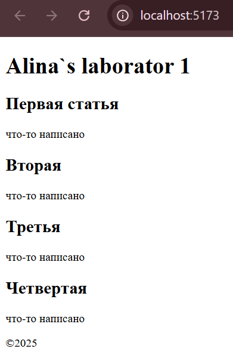

# Отчет лабораторной работы
Данный проект представляет собой простое React-приложение, отображающее заголовок, список статей и футер. Каждая статья содержит заголовок и текст.

## Инструкции по запуску проекта

### Требования
- Node.js (версия 18.x или новее)
- npm (или yarn)

### Установка зависимостей
```
npm install
```

### Запуск проекта
```
npm start
npm run dev
```

После запуска проект будет доступен в браузере по адресу `http://localhost:5173/`.


## Краткая документация

### Компоненты

#### `Article.jsx`
Компонент статьи, отображающий заголовок и текст.
```jsx
function Article({ title, text }) {
    return (
      <article>
        <h2>{title}</h2>
        <p>{text}</p>
      </article>
    );
}
export default Article;
```

#### `ArticleList.jsx`
Компонент, содержащий список статей.
```jsx
import Article from "./Article";

function ArticleList() {
    return (
      <>
        <Article title="Первая статья" text="что-то написано" />
        <Article title="Вторая" text="что-то написано" />
        <Article title="Третья" text="что-то написано" />
        <Article title="Четвертая" text="что-то написано" />
      </>
    );
}
export default ArticleList;
```

#### `Header.jsx`
Компонент, отображающий заголовок страницы.
```jsx
function Header() {
    return (
      <header>
        <h1>Alina`s laborator 1</h1>
      </header>
    );
}
export default Header;
```

#### `Footer.jsx`
Простой футер с копирайтом.
```jsx
function Footer () {
    return (
        <footer>
            &copy;2025
        </footer>
    );
}
export default Footer;
```

#### `App.jsx`
Главный компонент, объединяющий все остальные.
```jsx
import Header from "./components/Header";
import ArticleList from "./components/ArticleList";
import Footer from "./components/Footer";

function App() {
  return (
    <div>
      <Header />
      <ArticleList />
      <Footer />
    </div>
  );
}
export default App;
```

## Примеры использования
Приложение запускается через `npm start`, после чего в браузере отобразится заголовок, список статей и футер.

Пример отображения в браузере:



## Список использованных источников
- [Официальная документация React](https://react.dev/)
- [Node.js документация](https://nodejs.org/en/docs/)


# Контрольные вопросы


1. **Что такое JSX и зачем он используется в React?**  
   JSX — это абстракция, которая позволяет использовать синтаксис HTML внутри вашего кода JavaScript и с помощью которой вы можете создавать компоненты React, которые выглядят как стандартная HTML-разметка.

2. **Чем функциональные компоненты отличаются от классовых?**  
   Различие между функциональными и классовыми компонентами заключается в их синтаксисе и возможностях. Функциональные компоненты более простые и компактные, не имеют состояния и методов жизненного цикла в своем синтаксисе, что делает их быстрее и легче в написании и понимании.

3. **Как передавать данные в компонент через props?**  
   Функциональные компоненты принимают props в качестве единственного аргумента, поэтому мы можем всегда передавать свойства как props.

   `
   function MyComponent(props) {
     return <p>{props.text}</p>;
   }
   `

   Либо использовать деструктуризацию:

   `
   function MyComponent({ text }) {
     return <p>{text}</p>;
   }
   `

4. **В каком формате принимаются props в функциональном компоненте?**  
   В функциональном компоненте React props передаются как аргумент функции.

